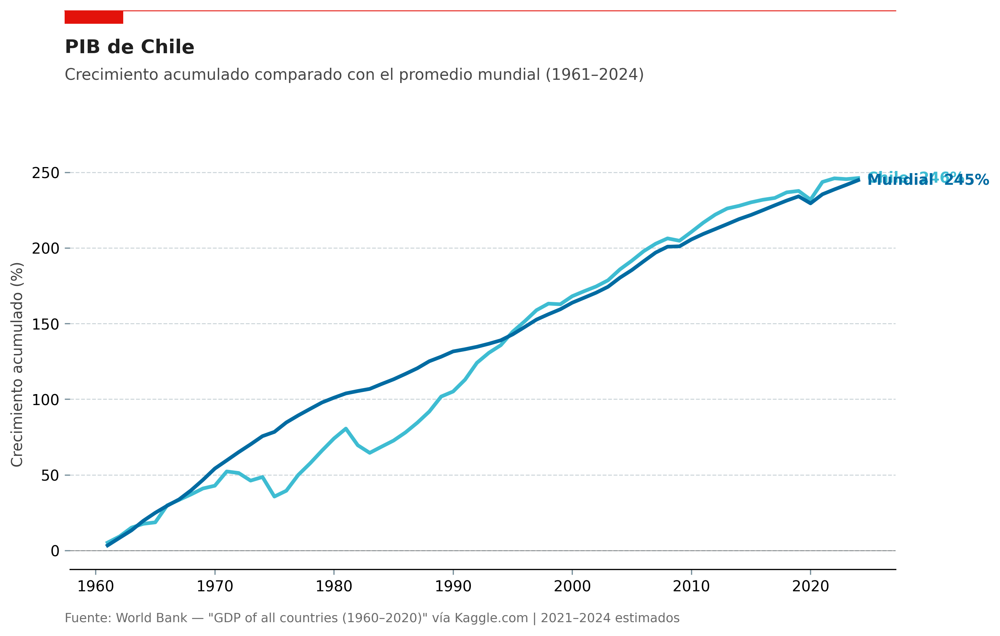
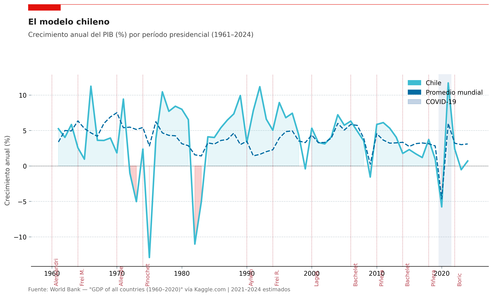
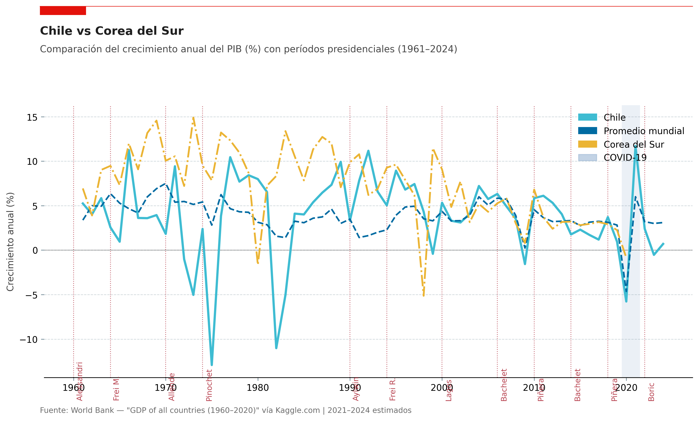
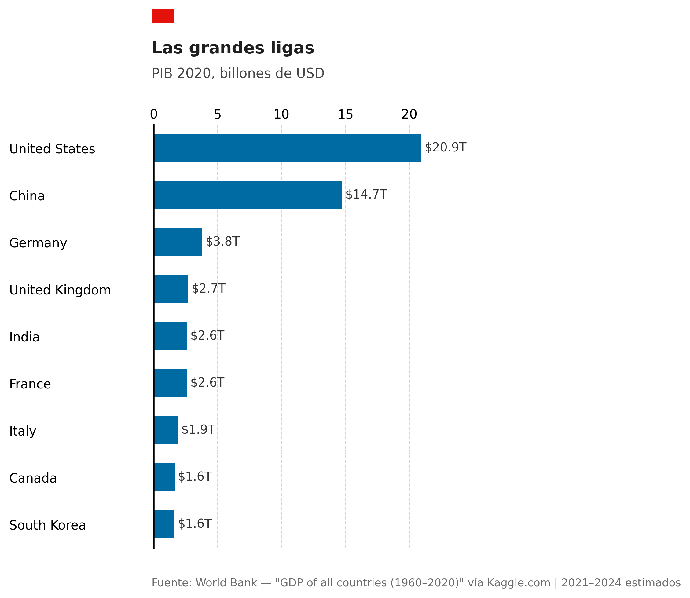

# Chile GDP Analysis 🇨🇱

Análisis visual del crecimiento económico de Chile (1961–2024) usando datos del **Banco Mundial**.
El proyecto explora la evolución del PIB chileno en contexto con el promedio mundial y Corea del Sur, e identifica patrones por período presidencial.

---

## Visualizaciones

### Crecimiento acumulado: Chile vs Mundo


Suma acumulada del % de crecimiento anual desde 1961. Permite comparar el desempeño total de Chile frente al promedio mundial a lo largo del tiempo.

---

### Crecimiento anual % por período presidencial


Volatilidad del PIB chileno año a año, contextualizada con los cambios de gobierno. Se destacan los períodos de contracción (área roja) y el impacto del COVID-19 (banda gris).

---

### Chile vs Corea del Sur


Comparación con Corea del Sur, un caso de estudio recurrente en economía del desarrollo. Ambos países partieron desde niveles similares en los años 60 con trayectorias muy distintas.

---

### Top 9 economías del mundo (2020)


Ranking de las 9 economías con mayor PIB absoluto en 2020, en billones de USD. Estilo visual inspirado en *The Economist*.

---

## Estructura del proyecto

```
chile_gdp/
├── chile_gdp_analysis.ipynb   # Notebook principal con todo el análisis
├── data/
│   ├── gdp_growth.csv          # Crecimiento anual del PIB por país (World Bank)
│   ├── gdp_1960_2020.csv       # PIB absoluto por país en USD
│   └── ...
└── images/                     # Gráficas exportadas en alta resolución (300 dpi)
```

## Datos

| Dataset | Fuente | Período |
|---|---|---|
| Crecimiento anual del PIB (%) | World Bank via Kaggle | 1960–2020 |
| PIB absoluto en USD | World Bank via Kaggle | 1960–2020 |
| Datos 2021–2024 | Estimaciones (World Bank, FMI) | 2021–2024 |

- Dataset principal: [GDP of all countries (1960–2020)](https://www.kaggle.com/datasets/zgrcemta/world-gdpgdp-gdp-per-capita-and-annual-growths) vía Kaggle

## Metodología

- El **promedio mundial** se calcula como la media simple del % de crecimiento de todos los países disponibles en el dataset para cada año.
- El **crecimiento acumulado** es la suma de los valores anuales (no el crecimiento compuesto), útil para comparar tendencias de largo plazo.
- Los datos 2021–2024 son estimaciones basadas en reportes del Banco Mundial y el FMI.
- Los **períodos presidenciales** de Chile se marcan desde el año de inicio del mandato.

## Cómo ejecutar

```bash
# Instalar dependencias
pip install pandas matplotlib jupyter

# Abrir el notebook
jupyter notebook chile_gdp_analysis.ipynb
```

## Stack


